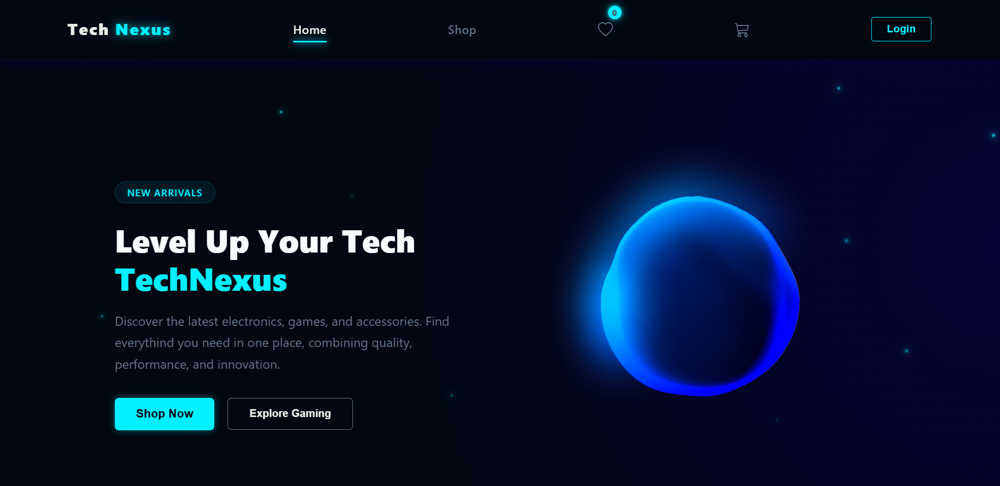
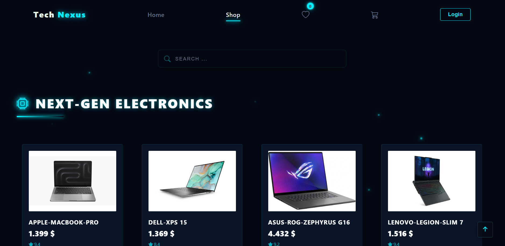
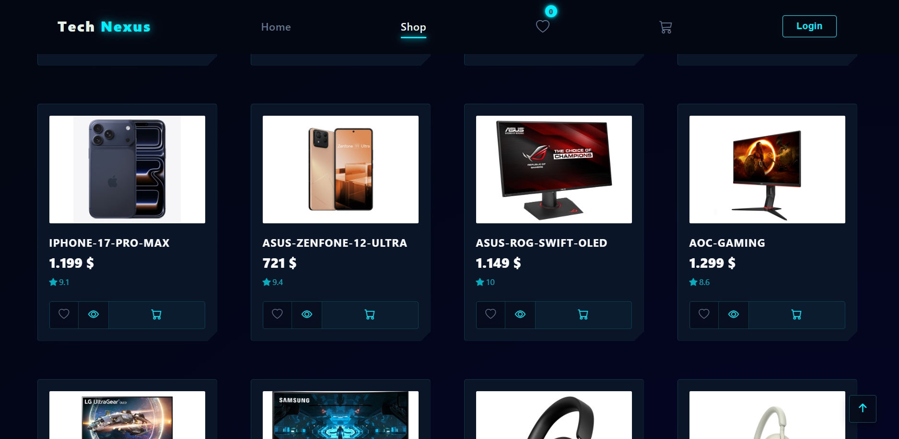
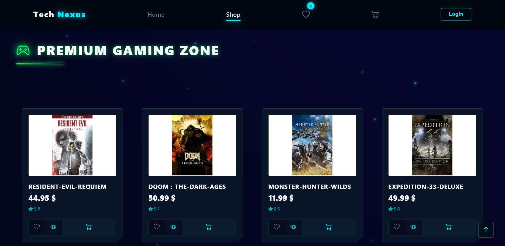
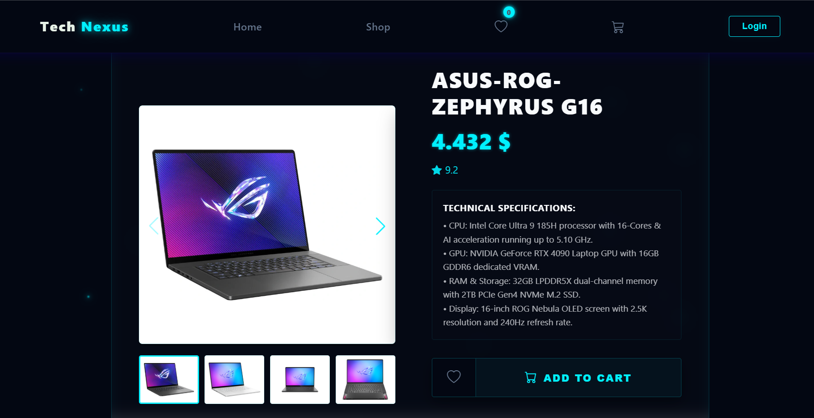

# 🛸 TechNexus - Next-Gen E-Commerce Space

  

---

### 🌌 Overview
**TechNexus** is an elite, high-performance e-commerce platform built for gaming rigs, modern gadgets, and hardware enthusiasts. The application blends a sleek futuristic cyberpunk visual aesthetic with ultra-responsive architecture, advanced global state management, and seamless animations tailored for devices in **2026**.

🔗 **Live Demo Space:** [👉 Click Here to Open TechNexus Live](https://tech-nexus-j3r.netlify.app/)

---

### 🕹️ Advanced Architecture & Features

#### 🔬 Premium UI/UX Core
* **Dynamic Media Framework:** Engineered an adaptive **Swiper.js** module utilizing ultra-light **WebP** + **jpg** asset arrays with fluid cross-fade stabilization on mobile, independent of desktop assets.
* **Smart Floating Interaction Layer:** Developed non-destructive floating label form inputs with localized conditional constraints.
* **Hardware Stabilized Search:** Custom search filter wrapper built with absolute transform suppression on touch devices to ensure flawless hardware performance and zero rendering lag.

#### 🛰️ Architecture & Engineering
* **Global Ecosystem Logic:** Multi-state Cart and Favorites array processing synchronized seamlessly via **React Context API**.
* **Zero-Fault Routing Guard:** Hardened client-side navigation paths on cloud architecture via server-side pattern matching rules (`_redirects`), completely eliminating 404 router errors.

---

### 📸 Interface Showcases

  <table width="100%">
    <tr>
      <td width="50%" align="center">
        
<b>🌌 Global Shop System</b>

        
      </td>
      <td width="50%" align="center">
        
<b>🌌 Global Shop System</b>

        
      </td>
    </tr>
    <td width="50%" align="center">
        
<b>🌌 Global Shop System</b>

        
    </td>
    <td width="50%" align="center">
        
<b>⚡ Dynamic Core Details</b>

        
    </td>
  </table>

---

### 💻 Built With Precision
* **React.js & Hooks** (Functional Ecosystem)
* **Swiper.js** (Cross-device Dynamic Sliding)
* **Framer Motion & Spline 3D** (Cinematic Interactive Graphics)
* **CSS3 Custom Variables & WebP Technology** (High Performance Rendering)
* **Netlify Cloud Architecture** (Continuous Automated Deployment)

---

  
<b>Engineered with Precision & High Performance by Jaafar</b>

